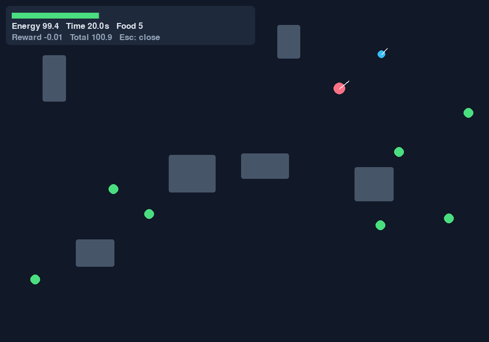

# Fruit Fly Connectome Survival AI

**A reproducible reinforcement learning testbed for connectome-constrained
artificial neural architectures.** Python 3.11/3.12 · Gymnasium · PyTorch ·
Stable-Baselines3 PPO · neuPrint · CPU-first.

> The bundled dataset is an explicitly **SYNTHETIC FALLBACK**, for development and
> software verification only. Real MaleCNS/neuPrint data is downloaded separately.
> No biological performance advantage or completed neuroscience result is claimed.

## Project Overview

An agent survives in a continuous 2D world by collecting food, managing energy,
avoiding walls/obstacles and escaping a pursuing predator. A dense MLP and a
directed sparse network train through the **same SB3 PPO implementation**.
Post-training experiments probe unseen maps, sensor noise, neuron damage,
connection damage and topology/weight ablations.

## Research Question

Does an artificial neural architecture constrained by measured Drosophila
connectome topology differ from a conventional dense neural network in learning,
generalization, noise tolerance and resilience to network damage?

This repository provides a runnable experiment, not an answer assumed in advance.

The first local 20k-step runs collapsed to stationary policies with no food
collection. A completed PPO run therefore does **not** establish learned survival.
The opt-in revised protocol and behavioral diagnostics are described in
[learning diagnostics and protocol revision](docs/LEARNING_FIX.md).



*Actual rendered heuristic rollout: blue agent, pink predator, green food. This
preview shows environment behavior, not a trained or biological agent.*

## Why Drosophila Connectome?

Measured directed neuron-to-neuron connectivity supplies a structured architectural
constraint with recurrent paths and nonuniform degree. MaleCNS is accessible through
neuPrint; original body IDs, synapse counts and available type/instance annotations
can be retained. Selecting a small induced subgraph makes initial CPU experiments
manageable while exposing selection and boundary effects that must be reported.

## Architecture

```text
neuPrint / MaleCNS --token--> bounded downloader --> cached CSV + provenance/hashes
                                                        |
offline SYNTHETIC fixture --explicit config only----------+
                                                        v
                                            filter + induced subgraph
                                                        |
                                  incoming-weight normalization + I/O mapping
                                                        v
Gymnasium observations --> dense MLP OR directed sparse recurrent microsteps
                                                        |
                                        shared linear actor/value heads
                                                        v
                                      Stable-Baselines3 PPO + checkpoints
                                                        |
                            paired evaluations --> raw CSV --> summaries/plots
```

All commands use the installed `fly_connectome` package under `src/`; script entry
points call the same CLI. Configuration paths inside YAML resolve against this
repository, while `extends` resolves relative to its YAML file. Use the editable
installation below; this is a repository application, not a self-contained wheel
distribution of the data/configuration files.

## Environment

`FruitFlySurvivalEnv` implements Gymnasium `reset`, `step`, `render`, `close`,
`observation_space` and `action_space`. The default world is **100 × 70 logical
units**, rendered at 1000 × 700 pixels. Positions and velocity do not depend on
render size. One step represents 0.2 seconds.

| Action | Behavior |
|---|---|
| 0 | Idle, with basal energy drain |
| 1 | Forward movement |
| 2 / 3 | Turn left / right in place |
| 4 | Sprint forward at increased energy cost |

The float32 observation is a 13-vector in a `Box(-1, 1)`:

```text
food distance, food relative sin/cos,
predator distance, predator relative sin/cos,
front/left/right obstacle clearance,
energy ratio, speed ratio, heading sin/cos
```

Distances to food/predator are divided by the world diagonal. Obstacle rays are
normalized by sensor range and include walls. Food and predator sensors provide
idealized nearest-target information without occlusion. An image observation
adapter could be added as a Gymnasium wrapper without changing task physics.

Food spawns outside obstacles and away from the agent; collection restores capped
energy, adds reward and respawns food. Predator pursuit uses a detection radius
and obstacle-aware local steering; outside it, heading wanders. Easy/normal/hard
scales are YAML settings. Maps may be procedural or an explicit list of
`[x, y, width, height]` rectangles. Spawning has a bounded rejection sampler and
clear failures for impossible maps.

Agent/predator movement uses swept expanded rectangles, conservative at corners,
with synchronized substeps for food/contact events. Capture and energy depletion
are true terminations; the episode step limit is a truncation, which SB3
bootstraps. Local pursuit is not global path planning; map free-space connectivity
and food reachability are not guaranteed for arbitrary supplied obstacle layouts.

Reward coefficients are in YAML. Event rewards are combined with bounded
potential shaping `gamma * Phi(next) - Phi(current)`, with zero potential at true
terminal states and the same gamma as PPO. This avoids an unbounded reward from
oscillating around food. Basal drain makes infinite idling impossible, but reward
coefficients still need empirical calibration; no claim of an optimal foraging
policy is made from smoke tests.

## Baseline Model

A shared tanh MLP, default `[128, 128, 64]`, feeds separate linear categorical
policy and scalar value heads. Persistent masks enable hidden-neuron and
feature-weight damage without overwriting learned parameters. This is standard
PPO with a custom feature extractor, not a custom optimizer or unverified PPO
reimplementation.

## Connectome Model

An edge exists in the recurrent core **if and only if** it exists in the selected
directed graph. Original synapse counts initialize incoming-strength-normalized
weights. There is no dense N×N parameter matrix or all-to-all hidden bypass.

For observation x, microstep k and neuron j:

```text
h_0 = 0
s[I] = Encoder(x); s[other neurons] = 0
h_(k+1)[j] = mask[j] * tanh(
    gain * sum_(i->j in E)(edge_mask[i,j] * w[i,j] * mask[i] * h_k[i])
    + s[j] + b[j])
features = h_K[O]
policy_logits = Linear_policy(features)
value = Linear_value(features)
```

`index_add` implements edge aggregation, O(BE) intermediate messages and O(BN)
state per microstep. K defaults to 4; cycles and self-edges in the measured graph
are preserved, without topological sorting. **Recurrence is within a decision.**
SB3 PPO resets h to zero for each observation; it does not train temporal memory
across environment steps. `evolve(observation, state)` provides explicit state
input/output for a future sequence-aware trainer. Persisting hidden state across
shuffled vanilla PPO minibatches would be incorrect and is not done here.

Input neurons default to the highest out-degree nodes (stable body-ID tie-break).
Outputs are separate high-in-degree nodes reachable from inputs within K updates.
Both mappings are stored in each model's serialized spec. Explicit original IDs
can be supplied with `input_neurons` / `output_neurons`; the default algorithmic
roles are **not asserted to be biological sensory or motor annotations**.

Trainable: sensory projection, neuron biases, actor/value heads and, by default,
existing edge weights. `train_edge_weights: false` freezes only edge weights.
Topology and recurrent gain are fixed. Initial weights are positive normalized
synapse counts, but learned weights can change sign and are not constrained by
Dale's law or neurotransmitter identity. This is artificial computation.

## Connectome Data Source

The preferred source is [Janelia MaleCNS](https://male-cns.janelia.org/download/),
using the official [neuprint-python query API](https://connectome-neuprint.github.io/neuprint-python/docs/queries.html).
The current default dataset is `male-cns:v1.0`; it is configurable and may change
on the server. The selected dataset/version is recorded in the downloaded manifest.

1. Sign in to [neuPrint](https://neuprint.janelia.org/).
2. Open your account menu and obtain the API token. See the official
   [authentication instructions](https://connectome-neuprint.github.io/neuprint-python/docs/quickstart.html).
3. Set environment variables in your shell. `.env.example` documents them; the
   program does not automatically load `.env` files.

PowerShell:

```powershell
$env:NEUPRINT_TOKEN = 'your-personal-token'
$env:NEUPRINT_SERVER = 'https://neuprint.janelia.org'
$env:NEUPRINT_DATASET = 'male-cns:v1.0'
python scripts/download_connectome.py --size 2000
```

Bash:

```bash
export NEUPRINT_TOKEN='your-personal-token'
export NEUPRINT_SERVER='https://neuprint.janelia.org'
export NEUPRINT_DATASET='male-cns:v1.0'
python scripts/download_connectome.py --size 2000
```

The downloader begins with a high-synapse-count neuron, or user-supplied original
`--seed-ids`, or `--neuron-type`. It expands measured weak connectivity in bounded
batches, then fetches induced directed edges and metadata. Non-overlapping primary
ROI connection rows plus NotPrimary are summed once per neuron pair. This selection
is biased toward strongly connected neighborhoods; it does not represent the full
CNS. Downloading 2000 candidate neurons allows a 500/1000-node training selection.
For 5000-node experiments request at least 5000 candidates and adjust memory/batch
settings. The bundled fixture has only 512 nodes and cannot supply a 1000-node graph.

Cache format in `data/processed/malecns/`:

```text
neurons.csv   neuron_id, type, instance, ...available metadata
edges.csv     source_neuron, target_neuron, weight
metadata.json data_kind, source, dataset, retrieval time, selection, SHA-256 hashes
```

Existing caches are loaded without credentials or network access. `--force`
explicitly refreshes them. API errors explain the required setup, without logging
tokens. `--allow-synthetic-fallback` explicitly returns the fixture on failure and
logs a warning; it does **not** overwrite or masquerade as the real cache. Train the
fixture using `configs/offline.yaml`. `configs/connectome.yaml` rejects synthetic
data. Original downloaded data's license/citation obligations are separate from
the MIT code license; inspect source terms before redistribution.

Preprocessing supports `random`, `high_degree`, `connected_component` (default),
`bfs` and `biologically_selected`. Connected means **weakly connected**. All are
induced subgraphs, retaining directed edges. BFS uses original seed IDs; extra
seeds must fit in the same selected connected expansion. Biological selection
requires real data and explicit existing metadata filters, e.g.
`biological_filters: {type: [actual_type_from_neurons_csv]}`. Missing metadata is
an error, never invented labels. You may enrich local neuron tables with a real
`region` column; imported ROI lists are retained as pipe-separated annotations.

## Installation

From the repository root, install Python **3.11 or 3.12** and then:

```bash
python -m venv .venv
```

Activate with `.venv\Scripts\Activate.ps1` in PowerShell or
`source .venv/bin/activate` on Linux/macOS. If shell activation is restricted,
invoke `.venv\Scripts\python.exe` directly on Windows.

```bash
python -m pip install -r requirements.txt
python -m pip check
python -m pytest -q
```

For CPU-only Linux installations, install CPU Torch before the requirements to
avoid unnecessary CUDA wheels:

```bash
python -m pip install torch --index-url https://download.pytorch.org/whl/cpu
python -m pip install -r requirements.txt
```

Dependencies use bounded compatible ranges. Each training manifest records exact
runtime versions. CI is configured for Python 3.11/3.12 on Linux and Windows with
offline tests; a successful local run does not imply that remote CI has run.
`requirements-lock-windows-py312.txt` additionally captures the exact locally
verified Windows/Python 3.12 environment; use the regular requirements for other
platforms or Python versions.

## Quick Start

No credentials or pretrained binary needed:

```bash
python scripts/run_demo.py
```

This is a labeled, untrained heuristic. Escape/window close exits the demo.
For a terminal-only machine:

```bash
python scripts/run_demo.py --headless --steps 100 --snapshot results/demo.png
python scripts/run_experiments.py --config configs/smoke.yaml
python scripts/generate_plots.py --output results/smoke
fly-ai graph --path data/sample/synthetic --limit 100
```

The smoke suite uses a 64-node synthetic subgraph, 128 PPO steps/model and short
episodes. It verifies plumbing; it cannot measure convergence or biological effects.
For the full 500-node **synthetic software** configuration, use `configs/offline.yaml`.

## Training

```bash
python scripts/train_baseline.py
python scripts/download_connectome.py --size 2000
python scripts/train_connectome.py
```

Offline equivalent and CLI overrides:

```bash
python scripts/train_connectome.py --config configs/offline.yaml
fly-ai train --config configs/baseline.yaml --seed 43 --timesteps 20000
python -m fly_connectome train --config configs/smoke.yaml --model baseline
```

`configs/default.yaml` contains every environment/reward/model/training/experiment
setting. Defaults are a modest starting budget, not a claim of sufficient training.
The original motion/reward defaults are retained for reproducibility. For the
revised exploratory protocol, run the smaller comparison before the full suite:

```bash
python scripts/run_experiments.py --config configs/learning.yaml --experiment comparison
python scripts/generate_plots.py --config configs/learning.yaml
```

This trains both architectures for 32,768 steps each on two training seeds and
writes to `results/learning_v2/`, preserving earlier `results/` files. It needs
the real cached connectome. Use `configs/learning_smoke.yaml` for a short, explicitly
synthetic check of all six experiment paths. Train just one revised model with
`python scripts/train_baseline.py --config configs/learning.yaml` or
`python scripts/train_connectome.py --config configs/learning.yaml`.

Checkpoints and resolved configs are written under
`results/models/<model>_seed<seed>_<fingerprint>/`. Fingerprints include source code,
config, graph spec, provenance and key dependency versions. Cached checkpoints
are reused only when these match and a completed run manifest exists.

Each run stores `model.zip`, `config.yaml`, `run.json`, `episodes.csv`, TensorBoard
logs, and a selected graph snapshot/statistics for sparse models. Models serialize
their topology/mapping/masks; loading a checkpoint does not require the original
dataset file. Only load checkpoints you trust (SB3 serialization includes Python
objects). View metrics with:

```bash
tensorboard --logdir results/models
```

With `training.validation_seeds` enabled (the default), training also writes
`validation.csv`, `reference_validation.csv` and `learning_health.json`. These
use separate development episodes, both deterministic and sampled PPO actions,
and idle/constant-turn/random controls. No-food and stationary policies produce
explicit warnings. `foraging_observed` only means at least one food event was
measured; compare with controls before claiming learning. Use `validation_seeds: []`
only to disable these checks explicitly. Old saved configs without this field
still load. Validation does not select checkpoints or train on its episodes.

To inspect an existing checkpoint, use `fly-ai evaluate path/to/model.zip` and
optionally `--stochastic`. The CLI writes a separate mode-labeled CSV beside that
checkpoint unless `--output` is supplied. Sampled actions are seeded per episode;
evaluation restores the caller's Torch RNG state.

## Experiments

```bash
python scripts/run_experiments.py --config configs/experiments.yaml
python scripts/generate_plots.py
```

The runner trains/reuses matched seeds, then produces real episode-level CSVs and
seed-level summaries. The six experiment names are `comparison`, `generalization`,
`sensor_noise`, `neuron_damage`, `edge_damage`, and `ablation`:

```bash
fly-ai experiments --config configs/offline.yaml --experiment sensor_noise
fly-ai experiments --config configs/experiments.yaml --experiment ablation
```

Use a distinct `output_dir` when changing protocols so files from different
experiments are not combined manually. The full defaults include three training
seeds, five held-out episode seeds and three random lesion seeds.

## Damage Testing

```bash
fly-ai experiments --config configs/experiments.yaml --experiment neuron_damage
fly-ai experiments --config configs/experiments.yaml --experiment edge_damage
```

Neuron damage defaults: 0/5/10/20/30/40/50%. Edge damage: 0/5/10/20/30%.
Noise: 0/5/10/20/30%. Damage masks are fixed per evaluation condition, restored
between conditions, reproducibly nested across fractions, and never retrained.
Baseline hidden units have an analogous activation-mask mechanism. Both random
and high-degree neuron damage are evaluated. Fractions and replicates live in YAML.

## Generalization Testing

```bash
fly-ai experiments --config configs/experiments.yaml --experiment generalization
```

The runner tests unseen obstacle layouts, clustered food distribution, faster
predators, and their combination, each against paired in-distribution evaluation.
The default train/unseen layout seed lists are disjoint and validated. Use
procedural layouts for this protocol; fixed rectangles do not change with seed.

## Metrics

Episode reward/length, survival seconds, food collected, remaining/spent energy,
food per energy spent, distance traveled, collisions, capture indicator, encounter
and escape counts/rate, termination reason and map seed are recorded. Training
records timesteps/wall time; manifests record parameter counts and actual PPO steps.
New runs also record each action's count and the fraction of steps with zero
actual displacement. Experiment CSVs include the policy mode, and
`csv/learning_health.csv` diagnoses intact policies per architecture/training seed.
The runner reports collapse but still permits explicitly requested perturbation
experiments; a flat damage curve from a non-foraging policy is not resilience.

Summary means, SD and SEM treat independent **training seeds** as replicates,
averaging episodes/lesion samples first. One seed yields no uncertainty band.
Reward retention is undefined for non-positive reference reward; food retention
is undefined with no intact food collection. CSVs use missing values for those
ratios while preserving raw scores and differences. See the full
[experiment protocol](docs/EXPERIMENT_PROTOCOL.md) for definitions and confounds.

## Results

No trained biological results are distributed. Any locally generated smoke files
are actual short software-check rollouts on a synthetic graph and must not be
presented as biological evidence or a converged comparison. Training checkpoints,
large data and generated results are ignored by Git.
Local measured pilot outcomes, including failed policies, are documented in
[the learning investigation](docs/LEARNING_FIX.md); they do not establish a
connectome advantage or convergence.

See [local verification](docs/VERIFICATION.md) for the executed test suite, smoke
pipeline, 500-node CPU check, exact scope and unverified integrations.

The plot command creates training reward/survival/food curves, baseline comparison,
generalization comparison, sensor-noise curves, neuron/edge-damage curves,
retention curves and an ablation comparison from saved CSVs. No results are
fabricated when files are absent. Training curves are trailing 10-episode means,
not held-out learning curves; uncertainty bands on evaluation plots are seed SEM.
New logs also produce distance and stationary-fraction training curves. Legacy
logs missing those fields are supported.

## Project Structure

```text
configs/                      inherited, validated YAML protocols
data/sample/synthetic/        explicit offline fixture + provenance
data/raw/, data/processed/    ignored download/cache directories
src/fly_connectome/
  environment/                state, physics, sensors, reward, Gymnasium API
  connectome/                 neuPrint client/downloader, graph IO, selection/stats
  models/                     MLP, sparse dynamics, degree-preserving control
  training/                   common PPO, callbacks, paired evaluation
  experiments/                all six protocols and independent-seed summaries
  visualization/              Pygame, graph samples, result figures
  utils/                      config paths, validation, seeding/device selection
  cli.py, demo.py              public command dispatcher and immediate demo
scripts/                      workflow entry points
tests/                        offline unit/integration/CLI tests
docs/                         research protocol and verification notes
results/{csv,plots,models}/    generated and ignored
.github/workflows/ci.yml       offline tests, lint, smoke pipeline
```

## Hardware Requirements

Target: CPU with 8 GB RAM; 16 GB is recommended. GPU is optional. These are design
targets, not measured guarantees on every 8 GB machine. Begin with the smoke
config, then 500 nodes. Default Torch threads = 2 and batch size = 64. Memory
depends on **edges × batch × microsteps**, not only neuron count; dense measured
subgraphs can be much more expensive than the bundled sparse fixture.

`device: cpu`, `auto`, or `cuda` is supported. Auto uses CUDA if available; an
explicit unavailable CUDA request produces a clear error. CPU is the reproducible
default; CUDA scatter reductions can be nondeterministic. Identical seeds do not
guarantee bitwise equality across hardware/library versions.

Optional headless CPU container:

```bash
docker build -t fruit-fly-survival-ai .
docker run --rm fruit-fly-survival-ai
```

The Dockerfile is supplied for convenience; GUI display forwarding is not configured.

## Limitations

- Real API integration needs a user token; offline mocks cannot verify server
  availability, permissions, current schema, or real dataset acquisition.
- Small induced subgraphs remove external inputs and outputs; results depend on
  selection, synapse thresholds, mapping, graph size and microstep count.
- Default model sizes are not parameter/compute matched. Compare both counts and
  budgets; architecture effects cannot be attributed to topology alone.
- PPO here has recurrent microsteps but no trained cross-step hidden memory.
- Ray sensors are partial while food/predator direction is idealized. Environment,
  collision corners, pursuit and metabolism are deliberately simplified.
- Procedural obstacle generation ensures valid spawns, not globally reachable food.
- Random rewiring preserves degrees and incoming weights but changes motifs and
  reachability. Degree-targeted injury and edge lesions differ between architectures.
- The included budgets/seeds are exploratory. Short-run plots are not scientific
  evidence, statistical significance, convergence or proof of damage superiority.

## Scientific Caveats

This project is a **bio-inspired / connectome-constrained artificial neural
architecture experiment**, not a simulation of a fruit fly brain. Connectivity
alone does not specify biological computation. Neurotransmitters, temporal and
cell-specific dynamics, neuromodulation, biophysical neuron properties, plasticity,
sensory preprocessing and motor systems are omitted or heavily simplified.
Synapse counts do not directly equal effective physiological weights. Artificial
tanh neurons, gradient learning and PPO are not claims about Drosophila learning.

## Future Work

Sequence-aware recurrent PPO with episode masks; metadata-grounded sensory/motor
mapping; multiple real subgraphs and degree/null-model controls; parameter- and
compute-matched baselines; held-out learning curves; bootstrap intervals; stronger
path planning/reachable-map generation; neurotransmitter-aware signed constraints;
activation visualization and an experiment dashboard. These are research extensions,
not required hidden steps for the current CLI/tests.

## References

- [MaleCNS official dataset and programmatic access](https://male-cns.janelia.org/download/)
- [neuprint-python documentation](https://connectome-neuprint.github.io/neuprint-python/docs/)
- [Gymnasium Env API](https://gymnasium.farama.org/api/env/)
- [Stable-Baselines3 custom policy/feature extractors](https://stable-baselines3.readthedocs.io/en/master/guide/custom_policy.html)
- [Schulman et al., Proximal Policy Optimization Algorithms](https://arxiv.org/abs/1707.06347)
- [Ng, Harada & Russell, Policy invariance under reward transformations](https://people.eecs.berkeley.edu/~russell/papers/icml99-shaping.pdf)

MIT license for project code and the generated synthetic fixture. Cite the exact
real dataset release and its required publications when using measured connectivity.
